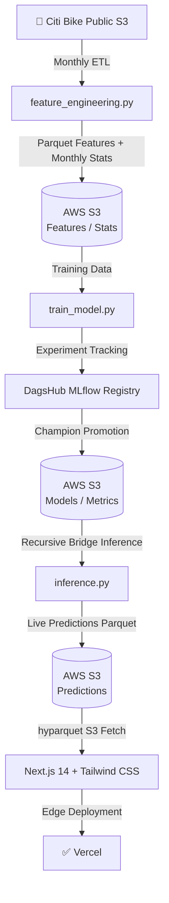

# 🏙️ NYC Citi Bike | Demand Intelligence Core

[](https://bike-taxi.vercel.app)
[](https://dagshub.com/)
[](https://aws.amazon.com/s3/)
[](https://lightgbm.readthedocs.io/)
[](https://github.com/astral-sh/uv)
[](https://www.evidentlyai.com/)
[](https://opensource.org/licenses/MIT)

A **production-grade, fully automated MLOps pipeline** for real-time Citi Bike demand forecasting across New York City. This system bridges a 20-day historical data lag — a fundamental constraint of Citi Bike's public S3 dataset — using a custom **Recursive Bridge** inference strategy. Live predictions are served via a modern Next.js portfolio dashboard with zero backend dependencies.

**🔗 Live Application:** [bike-taxi.vercel.app](https://bike-taxi.vercel.app)

---

## 🌟 Project Highlights

| Feature | Description |
|---|---|
| 🌉 **Recursive Bridge** | Walks hour-by-hour from the last known data point, auto-filling the 20-day public data lag to serve current predictions |
| 🤖 **Champion/Challenger Loop** | Automated monthly retraining with MLflow; challengers only promoted if they beat the current champion's MAE |
| 📊 **Drift Monitoring** | Evidently AI generates reports each training run, comparing training vs. holdout distributions |
| ⚡ **Zero-Backend Frontend** | Next.js reads live Parquet files directly from S3 via `hyparquet` — no API server required |
| 🗺️ **Production Dashboard** | Interactive CartoDB heatmaps, Recharts demand graphs, real-time MAE/RMSE/MAPE + feature importances |
| 🔄 **3-Pipeline CI/CD** | Three independent GitHub Actions workflows maintain fresh data, models, and predictions automatically |

---

## 🏗️ System Architecture



---

## ⚙️ Automated CI/CD Pipelines

Three independent GitHub Actions workflows keep the system fully autonomous:

| Workflow | Schedule | Script | Purpose |
|---|---|---|---|
| **Feature Engineering** | 1st of every month @ 5:00 AM UTC | `scripts/feature_engineering.py` | Pulls latest Citi Bike raw data, engineers time-series features, uploads Parquet to S3 |
| **Model Training** | 1st of every month @ 6:00 AM UTC | `scripts/train_model.py` | Trains challenger LightGBM, compares vs. champion, promotes if MAE improves, logs to MLflow |
| **Inference (Hourly)** | Every hour (`0 * * * *`) | `scripts/inference.py` | Runs Recursive Bridge, generates 28-hr demand forecast, writes Parquet predictions to S3 |

> **Note:** Feature Engineering runs 1 hour before Model Training to ensure fresh data is available for champion/challenger evaluation.

---

## 🛠️ Tech Stack

### 🤖 AI / ML & MLOps
- **Model:** LightGBM (Gradient Boosted Decision Trees)
- **Forecasting Strategy:** Recursive Multi-step (28-hour horizon)
- **Tracking:** MLflow + DagsHub (experiment registry & model versioning)
- **Drift Detection:** Evidently AI (training vs. holdout distribution reports)
- **Storage:** AWS S3 (Parquet features, Joblib model artifacts, JSON metrics)

### 🖥️ Frontend & Visualisation
- **Framework:** Next.js 14 (App Router)
- **Styling:** Tailwind CSS + Framer Motion animations
- **Maps:** Leaflet + CartoDB Dark (interactive demand heatmap)
- **Charts:** Recharts (hourly demand time series)
- **Data Parsing:** `hyparquet` (client-side Parquet reader — no backend needed)

### ⚙️ Engineering & Tooling
- **Python:** 3.12 · Pandas · NumPy · PyArrow · Scikit-learn · SciPy
- **Packaging:** `uv` (fast Python package & venv manager)
- **Containerisation:** Docker + Docker Compose
- **CI/CD:** GitHub Actions (3 automated workflows)
- **Notebooks:** Jupyter (EDA, modelling experiments, monthly analysis)

---

## 📂 Project Structure

```
bike_Taxi/
├── scripts/
│   ├── feature_engineering.py  # Monthly ETL: raw rides → time-series features
│   ├── train_model.py          # Champion/Challenger training & MLflow promotion
│   └── inference.py            # Recursive Bridge → live Parquet predictions
├── frontend_new/               # Next.js 14 dashboard (deployed to Vercel)
│   └── src/
│       ├── app/                # App Router pages & layout
│       ├── components/         # UI components (map, charts, metrics cards)
│       └── hooks/              # Custom data-fetching hooks
├── notebooks/
│   ├── 01_Data_Engineering.ipynb   # Raw data exploration & feature design
│   ├── 02_model_ml_tracking.ipynb  # Model experiments & MLflow tracking
│   └── 03_Monthly_Analysis.ipynb   # Monthly performance & drift analysis
├── .github/
│   └── workflows/
│       ├── feature_engineering.yml
│       ├── model_training.yml
│       └── inference.yml
├── Dockerfile
├── docker-compose.yml
└── pyproject.toml
```

---

## 🚀 Getting Started

### Prerequisites

Create a `.env` file in the project root with the following secrets:

```bash
AWS_ACCESS_KEY_ID=your_key
AWS_SECRET_ACCESS_KEY=your_secret
AWS_S3_BUCKET=your_bucket_name
MLFLOW_TRACKING_URI=https://dagshub.com/<user>/<repo>.mlflow
MLFLOW_TRACKING_USERNAME=your_dagshub_username
MLFLOW_TRACKING_PASSWORD=your_dagshub_token
```

### ML Pipeline (Local)

```bash
# Install uv (if not already installed)
curl -LsSf https://astral.sh/uv/install.sh | sh

# Sync dependencies
uv sync

# Run feature engineering
uv run scripts/feature_engineering.py

# Train & promote model
uv run scripts/train_model.py

# Run inference bridge
uv run scripts/inference.py
```

### Frontend (Local)

```bash
cd frontend_new
npm install
npm run dev
# → http://localhost:3000
```

### Docker

```bash
docker-compose up --build
```

---

## 📊 Evaluation & Monitoring

- **Live Metrics:** The dashboard surfaces real-time **MAE**, **RMSE**, and **MAPE** pulled directly from the latest S3 training artefact.
- **Feature Importances:** LightGBM feature importances are serialised to S3 and displayed in the dashboard — surfacing which temporal/spatial signals drive demand.
- **Drift Reports:** Every monthly training run generates an Evidently AI HTML report comparing the training distribution to the last 20% of holdout data.
- **Automated Promotion:** A challenger model only replaces the champion if it achieves a strictly lower MAE on the held-out test set, preventing silent model degradation.

---

## 📓 Notebooks

| Notebook | Description |
|---|---|
| `01_Data_Engineering.ipynb` | Raw Citi Bike data exploration, feature engineering design, and validation |
| `02_model_ml_tracking.ipynb` | LightGBM experiments, hyperparameter tuning, and MLflow run analysis |
| `03_Monthly_Analysis.ipynb` | Monthly demand patterns, data drift inspection, and seasonal trend analysis |

---

## 📝 License

Distributed under the **MIT License**. Developed with 🗽 for the NYC Fleet Intelligence community.
