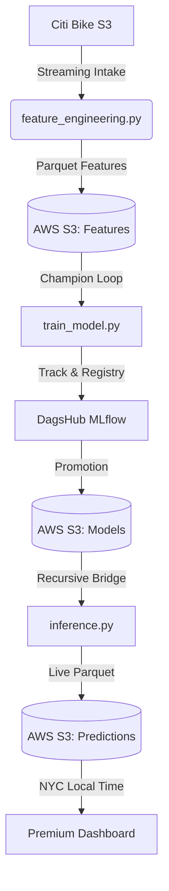

# 🏙️ NYC Citi Bike | Demand Intelligence Core

[](https://dagshub.com/)
[](https://www.docker.com/)
[](https://github.com/astral-sh/uv)
[](https://opensource.org/licenses/MIT)

A professional-grade, automated MLOps pipeline for real-time Citi Bike demand forecasting in New York City. This system bridges the gap between massive historical archives and live fleet operations using a state-of-the-art **Recursive Bridge** strategy.

---

## � Project Highlights

*   **Premium Intelligence Dashboard:** A world-class Streamlit interface featuring Glassmorphism, modern typography (**Inter & Outfit**), and interactive Altair analytics.
*   **Recursive Bridge Technology:** Automatically fills the 20-day historical data lag from Citi Bike's public S3 bucket, providing live forecasts for the **exact current hour**.
*   **High-Performance Engineering:** Processes 12 months of NYC trip data (millions of rows) using a single-pass streaming architecture—optimized for GitHub Runners.
*   **Automated MLOps Loop:** Full experiment tracking with **MLflow**, automated model promotion (Champion vs. Challenger), and data drift monitoring with **Evidently AI**.
*   **Lightning Fast Deployment:** Powered by `uv` for sub-second dependency resolution and a production-ready, multi-stage Docker environment.

---

## 🏗️ Architecture & Pipeline



---

## 🛠️ Tech Stack

*   **Core Logic:** Python 3.12, Pandas, LightGBM, Joblib.
*   **Cloud Infrastructure:** AWS S3 (Storage), boto3.
*   **MLOps & Monitoring:** MLflow (Tracking), Evidently AI (Drift Detection).
*   **Orchestration:** GitHub Actions, `uv`.
*   **Frontend:** Streamlit, Altair, Custom CSS (Glassmorphism).
*   **Containers:** Docker, Multi-stage builds.

---

## 🚀 Getting Started

### 1. Prerequisites
Ensure you have the following environment variables in a `.env` file:
```bash
AWS_ACCESS_KEY_ID=...
AWS_SECRET_ACCESS_KEY=...
AWS_S3_BUCKET=...
MLFLOW_TRACKING_URI=...
MLFLOW_TRACKING_USERNAME=...
MLFLOW_TRACKING_PASSWORD=...
```

### 2. Local Setup (Recommended)
We use `uv` for maximum performance.
```bash
# Install uv if you haven't
curl -LsSf https://astral.sh/uv/install.sh | sh

# Run the inference bridge
uv run scripts/inference.py

# Launch the premium dashboard
uv run streamlit run frontend/app.py
```

### 3. Docker Deployment
```bash
docker-compose up --build
```

---

## � Dashboard Features

*   **Live Metrics:** Real-time Trips/Hr forecast for the current NYC hour.
*   **Rush Hour Alerts:** Dynamic detection of critical demand windows.
*   **Timeline Brushing:** Zoom into specific time windows using interactive chart selectors.
*   **NYC Localization:** All data is displayed in **US/Eastern** time, perfectly aligned with city operations.

---

## 📝 License
Distributed under the MIT License. See `LICENSE` for more information.

**Developed with 🗽 for the NYC Fleet Intelligence community.**
