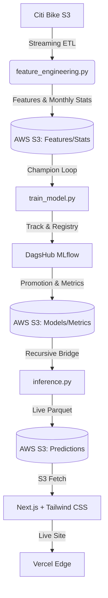

# 🏙️ NYC Citi Bike | Demand Intelligence Core

[](https://bike-taxi.vercel.app)
[](https://dagshub.com/)
[](https://aws.amazon.com/s3/)
[](https://github.com/astral-sh/uv)

A production-grade, automated MLOps pipeline for real-time Citi Bike demand forecasting in New York City. This system bridges a 20-day historical data lag using a state-of-the-art **Recursive Bridge** strategy, serving live predictions via a high-impact Next.js portfolio dashboard.

**Live Application:** [bike-taxi.vercel.app](https://bike-taxi.vercel.app)

---

## 🌟 Project Highlights

*   **Portfolio-Grade Dashboard:** Replaced basic Streamlit with a modern **Next.js 14** interface featuring Glow-morphism, **Framer Motion** animations, and **CartoDB Dark** Map integration.
*   **Recursive Bridge Technology:** Automatically fills the 20-day historical data lag from Citi Bike's public S3 bucket by walking forward hour-by-hour from the last known data point to the current hour.
*   **Automated MLOps Loop:** Full experiment tracking with **MLflow**, automated **Champion vs. Challenger** model promotion, and data drift monitoring with **Evidently AI**.
*   **Zero-Dependency Frontend:** The Next.js app fetches pre-computed aggregates and live Parquet predictions directly from S3 using `hyparquet`, ensuring lightning-fast performance without a heavy backend.
*   **Model Intelligence:** Surfaces real-time evaluation metrics (MAE, RMSE, MAPE) and live **Feature Importances** directly in the UI.

---

## 🏗️ Architecture & Pipeline



---

## 🛠️ Tech Stack

### 🤖 AI / ML & MLOps
*   **Model:** LightGBM GBDT (Gradient Boosted Decision Trees).
*   **Tracking:** MLflow + DagsHub.
*   **Drift/Val:** Evidently AI (Data Drift Reports).
*   **Strategy:** Recursive Multi-step Forecasting (28-hr horizon).
*   **Storage:** AWS S3 (Parquet features, Joblib models, JSON metrics).

### 🖥️ Frontend & API
*   **Framework:** Next.js 14 (App Router).
*   **Styling:** Tailwind CSS + Framer Motion.
*   **Data Viz:** Leaflet (Interactive Heatmaps), Recharts (Demand Graphs).
*   **Parsing:** `hyparquet` (Cloud Parquet reader).

### ⚙️ Engineering & Orchestration
*   **Processing:** Pandas + PyArrow (Streaming processing).
*   **Tooling:** `uv` (Fast Python packaging), Docker.
*   **CI/CD:** GitHub Actions (Hourly Inference, Monthly Training).

---

## 🚀 Getting Started

### 1. Prerequisites
Ensure you have the following environment variables in a `.env` file in the root:
```bash
AWS_ACCESS_KEY_ID=...
AWS_SECRET_ACCESS_KEY=...
AWS_S3_BUCKET=...
MLFLOW_TRACKING_URI=...
# Frontend also needs access to these for Vercel/Local env
```

### 2. Local Setup
We use `uv` for Python and `npm` for the frontend.

**ML Pipeline:**
```bash
# Install dependencies
uv sync

# Run the inference bridge
uv run scripts/inference.py
```

**Frontend:**
```bash
cd frontend_new
npm install
npm run dev
```

---

## 📊 Evaluation & Monitoring

*   **Drift Monitoring:** Every training run generates an **Evidently AI** report Comparing the training distribution vs. the last 20% of data.
*   **Automated Promotion:** Challengers are only promoted to S3 production if they outperform the current Champion's MAE on the test set.
*   **Real-time Metrics:** The dashboard pulls live MAE, RMSE, and feature importances from the latest training run, providing full transparency into model quality.

---

## 📝 License
Distributed under the MIT License. Developed with 🗽 for the NYC Fleet Intelligence community.
